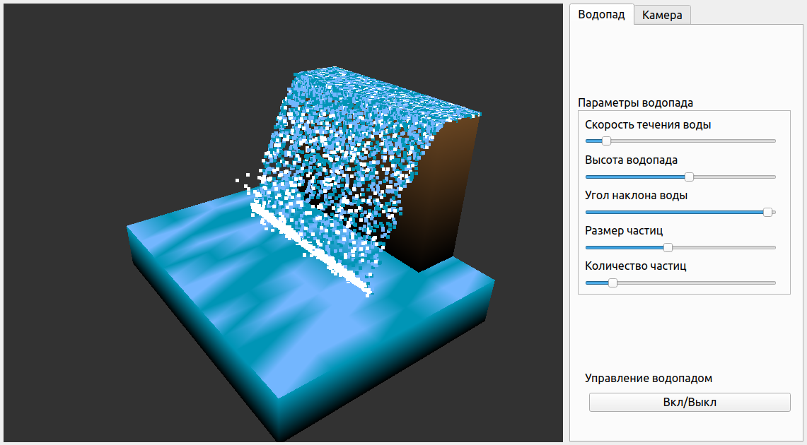

# Курсовая работа по Компьютерной графике (семестр 5)

[Я в Телеграм](https://t.me/amunra2) 

## Общая информация

* **Тема**: Разработка программного обеспечения для визуализации геометрической модели водопада
* **Семестр**: 5
* **Язык**: Python
* **РПЗ**: [ссылка](./course/docs/pdf/cgcp_rpz_cvetkov.pdf)
* **Презентация**: [ссылка](./course/docs/pdf/cgcp_presentation_cvetkov.pdf)
* **Код**: [ссылка](./course/src)

## Пример работы

## Примечание

Для сборки LaTex дополнительных файлов настроек не требуется

_@amunra2 (2021г.)_
